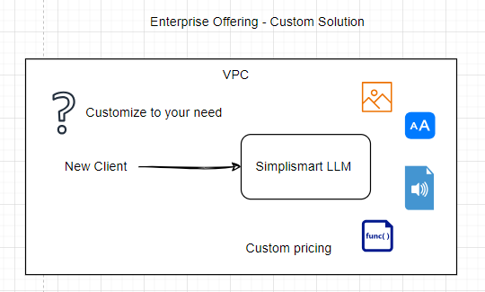

# Test Generation with Simplismart LLMs

- [Test Generation with Simplismart LLMs](#test-generation-with-simplismart-llms)
  - [Stage 1: Initial Client Communication](#stage-1-initial-client-communication)
  - [Stage 2: Problem Breakdown](#stage-2-problem-breakdown)
    - [Assumptions](#assumptions)
    - [High Level Architecture - Generate tests on CI/CD pipeline](#high-level-architecture---generate-tests-on-cicd-pipeline)
      - [NFR's](#nfrs)
    - [Understanding Deployment Choice](#understanding-deployment-choice)
      - [Shared Endpoint Integration](#shared-endpoint-integration)
      - [Private Endpoint Integration](#private-endpoint-integration)
      - [Enterprise Offering with Full Customization and CI/CD Integration](#enterprise-offering-with-full-customization-and-cicd-integration)
    - [Recommendation: Enterprise Offering with Full Customization](#recommendation-enterprise-offering-with-full-customization)
  - [Stage 3 - Internal Coordination and Product Roadmap Consideration](#stage-3---internal-coordination-and-product-roadmap-consideration)
    - [Roadmap for Enterprise Solution Integration](#roadmap-for-enterprise-solution-integration)
      - [Phase 1: Discovery \& Planning (Week 1-2)](#phase-1-discovery--planning-week-1-2)
      - [Phase 2: Architecture Setup \& Test Generation Agent Development (Week 3-6)](#phase-2-architecture-setup--test-generation-agent-development-week-3-6)
      - [Phase 3: Test Execution, Code Coverage \& Feedback Loop (Week 7-10)](#phase-3-test-execution-code-coverage--feedback-loop-week-7-10)
      - [Phase 4: Optimization \& Scalability (Week 11-12)](#phase-4-optimization--scalability-week-11-12)
      - [Phase 5: Security \& Performance Testing (Week 13-14)](#phase-5-security--performance-testing-week-13-14)
      - [Phase 6: Launch \& Monitoring (Week 15-16)](#phase-6-launch--monitoring-week-15-16)
  - [Stage 4: Execution Plan - Client Communication](#stage-4-execution-plan---client-communication)
    - [Timeline and Milestones](#timeline-and-milestones)
    - [Success Metrics](#success-metrics)
    - [Resource Allocation](#resource-allocation)
    - [Risk Management and Mitigation Strategies](#risk-management-and-mitigation-strategies)
    - [Client Presentation Summary](#client-presentation-summary)

 

## Stage 1: Initial Client Communication

Subject: Initial Discussion on Integrating Simplismart LLMs into Your CI/CD Pipeline

Dear [Client Name],

Thank you for reaching out to Simplismart regarding the use of our LLMs for generating integration tests within your CI/CD pipeline. I’m excited to explore how we can assist with your needs. To provide the best solution, I would appreciate more details about your current setup and expectations. This will help us determine the most suitable offering, whether it be shared endpoints, private endpoints, or our enterprise solution.

Could you kindly provide more information on the following:

**Current CI/CD Pipeline Setup:**

- What tools and platforms are you using for your Git-based CI/CD pipeline (e.g., Jenkins, GitLab, GitHub Actions, etc.)?
- Do you currently have any form of automated testing in place, and how do you manage it?

**Integration Requirements:**

- Are there specific programming languages, frameworks, or testing libraries that your integration tests need to support?
- What volume of tests do you anticipate running during each pipeline execution?

**Security & Compliance:**

- Do you have any specific security or compliance requirements we should be aware of (e.g., data residency, encryption, or industry-specific regulations)?
- Would your organization prefer running the LLMs on a shared infrastructure, or do you need more isolated/private environments for your tests?

**Scalability & Performance:**

- What are your scalability expectations in terms of peak usage or concurrent requests for generating tests?
- How critical is latency for your integration tests within the CI/CD process?

Based on your responses, I’ll recommend the most appropriate Simplismart solution for your needs and outline the next steps to help you get started. Feel free to let me know if you have any other questions or concerns at this stage.

Looking forward to your response!

Best regards,

[Your Name]

Solutions Architect | Simplismart

 

## Stage 2: Problem Breakdown

Integrating LLM-generated tests into a CI/CD pipeline introduces several key challenges:

**Pipeline Integration:**

- Ensuring smooth communication between the CI/CD pipeline and the LLM-based test generation API.
- Managing the latency of test generation and its impact on overall pipeline performance.

**Scalability & Throughput:**

- Handling multiple concurrent test generation requests, especially during peak development times, to avoid bottlenecks in the CI/CD process.

**Security & Data Privacy:**

- Ensuring that sensitive code or data used to generate tests remains secure, especially if shared or private endpoints are involved.

**Customization & Test Relevance:**

- Ensuring that the generated tests are relevant, covering edge cases and aligned with the client’s codebase, frameworks, and business logic.

### Assumptions

- The client has a moderate to high volume of test generation requests.
- The client has specific security/compliance needs requiring private infrastructure.
- There is no Test Gen Agent database required, as the agent workflow should be stateless and can be easily rescheduled on a different pod. If test gen needs any dashboard/reporting/analytics, then a database of all the scheduled jobs and there results can be maintained by the CI/CD system.

### High Level Architecture - Generate tests on CI/CD pipeline

> Recommended solution would be **Enterprise solution (Simplismart is responsible for Test Generation Agent)**,
>
> Incase clients wants to maintain the Test Generation Agent, Private endpoint or shared endpoint can be used. Feedback loop (Logs, Errors, Performance) for continuous improvement needs to be aggreed upon by client and Simplismart.

- On push the GitHub Action/Jenkins pipeline is triggered.
- Diff Analyser runs on the code diff
  - Check for new/modified files. if the file has lot of content consider running test generation on smaller chunks of file. i.e functions/classes.
  - Check for new/modified functions.
  - Filters out test files.
  - Filters out unsupported languages/frameworks.
- Test Generator runs on the filtered code diff
  - Generates tests for new/modified files/functions.
  - Saves generated tests to a file. (Inteligently choosing file names/paths based on language/framework)
  - Business rules aka System Instructions on test generation is injected into Test Generator.
- Test Executor runs on the generated tests
  - Executes the generated tests
  - Checks the results and reports any failures (Complilation errors, test failures)
- Code Coverage Analysis
  - Runs on the generated tests and checks if the threshold is met.
  - If not new test are generated for uncovered code.
- Generate a PR with test report for review
- Review Handler
  - Collects the review and sends to the test generator.
- Perform Post TestGen Steps
  - If the tests are approved, they are merged to the main branch.
  - If the tests are not approved, the PR is closed.
- Collect agent error and performance for quality assurance. which can be used for model improvement.
- Aggregate logs and push them to a centralized logging system or cloud logging.

#### NFR's

- Scalability:
  - Scaling of agents for test generation and execution. One Agent per pod.
  - Or the entire agent workflow can be containerized and scaled as a single unit. where the CI system would be responsible for triggering the workflow and the workflow would be self-contained.
- Security:
  - Data Encryption in transit and rest.
  - API Keys and Key Rotation.
- Secret Management for API keys and other sensitive information.
- Compliance as per client requirements.
- Performance:
  - Appropriate machine spec should be chosen based on the volume of tests and expected execution time.
  - Latency requirements should also be considered.
  - Leverage caching and asnyc test generation to improve performance.
  - Perform small incremenatal test execution if the language/framework supports it.
- High Availability & Disaster Recovery:
  - if agent is running on CICD pod, then the agent workflow should be stateless and can be easily rescheduled on a different pod.
  - if the agent is running as a containerized unit, then the agent workflow should be designed to be resilient and can be easily rescheduled on a different node.
  - There is no data stored on the CI/CD system.

### Understanding Deployment Choice

#### Shared Endpoint Integration

**High-level Architecture:**

The CI/CD pipeline calls Simplismart’s shared LLM endpoints via API to generate integration tests for every commit or PR. The generated tests are then integrated into the pipeline and executed.

**Advantages:**

- Low setup complexity.
- Cost-effective.
- Quick implementation.

**Disadvantages:**

- Shared infrastructure may introduce latency and resource contention during peak hours.
- Less control over security, customization and compliance.
- Limited flexibility if test generation requires specific business logic.

**Required Resources and Dependencies:**

- API integration in the existing CI/CD pipeline.
- Simplismart’s shared API key and documentation.
- Basic monitoring to ensure API performance.

**Assumptions:**

- The client has moderate security needs and can tolerate shared infrastructure.
- Test generation time is within acceptable limits for their pipeline.

#### Private Endpoint Integration

**High-level Architecture:**

The client deploys Simplismart’s private LLM endpoint on their own infrastructure or a dedicated cloud instance.

**Advantages:**

- Improved security, with data isolated from shared infrastructure.
- Faster test generation, data locality and caching.
- Customization options for specific testing needs.

**Disadvantages:**

- Higher inital cost and commitment to shared infrastructure.

**Required Resources and Dependencies:**

- Private instance of Simplismart’s LLM endpoint.
- Compute resources to host the endpoint and caching layer.
- Additional monitoring for the endpoint’s health and performance.

**Assumptions:**

- The client has a moderate to high volume of test generation requests, making caching effective.
- The client has specific security/compliance needs requiring private infrastructure.

#### Enterprise Offering with Full Customization and CI/CD Integration

**High-level Architecture:**

The client uses Simplismart’s enterprise offering, which provides full control over the LLM infrastructure, including on-premise deployment, custom API configurations, and end-to-end integration with the CI/CD pipeline.

**Advantages:**

- Full control over security, customization, and performance.
- Ability to deeply integrate test generation logic with the client’s unique business rules and testing framework.
- Highly scalable solution with no resource contention.

**Disadvantages:**

- Most resource-intensive and expensive solution.
- Longer time-to-market due to the complexity of setup and integration.
- Requires ongoing maintenance and monitoring of the infrastructure.

**Required Resources and Dependencies:**

- Full enterprise license for Simplismart’s LLM.
- Dedicated infrastructure for hosting the LLM, either on-premise or cloud.
- DevOps and engineering resources to manage and maintain the solution.

**Assumptions:**

- The client has strict security and compliance needs, as well as high test volume requiring fully isolated infrastructure.
- The client is willing to invest in a highly customized, long-term solution.

### Recommendation: Enterprise Offering with Full Customization

We recommend the Enterprise Offering for clients with strict security, compliance, and performance requirements. This solution provides full control over the infrastructure, ensuring that sensitive code and data remain secure through isolated on-premise or dedicated cloud deployment.

The enterprise solution allows for deep customization, enabling the client to tailor test generation based on their unique business rules, frameworks, and languages. It also offers superior scalability, handling high test volumes without resource contention, ensuring faster test generation and execution.

With full infrastructure control, clients can optimize performance and latency, implement incremental testing, and meet long-term growth needs. Though the upfront cost is higher, it’s a worthwhile investment for clients requiring customized, secure, and scalable testing solutions.

This offering is ideal for organizations with stringent compliance needs, high test volumes, and a focus on long-term, scalable performance.

 

## Stage 3 - Internal Coordination and Product Roadmap Consideration

> - Assuming the **Enterprise solution** is chosen, the following roadmap is proposed. **Simplismart already has the Code Gen model**.
> - Keep a buffer of 2 weeks for each phase to accommodate unforeseen issues and delays.
> - The timeline is very rough estimate and can be adjusted based on the feedback and the scope of work.
> - Identify tasks that can be done in parallel and adjust the timeline accordingly.

### Roadmap for Enterprise Solution Integration

#### Phase 1: Discovery & Planning (Week 1-2)

- Identify current CI/CD pipeline tools (Jenkins, GitHub Actions, etc.).
- Define test generation requirements, supported languages, and frameworks.
- Establish security & compliance needs (data encryption, API keys, etc.).
- Plan infrastructure setup for scaling test generation agents.

**Deliverables:**

- Requirements document
- Initial architecture plan
- Security and compliance checklist

#### Phase 2: Architecture Setup & Test Generation Agent Development (Week 3-6)

- Deploy Simplismart enterprise solution and set up private endpoints.
- Develop and integrate the **Diff Analyzer** and **Test Generator** into the CI/CD pipeline.
- Implement business rules for intelligent test generation and naming conventions.

**Deliverables:**

- CI/CD pipeline integration
- Private endpoints setup

#### Phase 3: Test Execution, Code Coverage & Feedback Loop (Week 7-10)

- Integrate **Test Executor** for real-time test execution and coverage analysis.
- Set up feedback loop for error logging and performance improvement.
- Begin **PR generation and review** workflow.

**Deliverables:**

- Test execution logs
- Review and PR feedback

#### Phase 4: Optimization & Scalability (Week 11-12)

- Implement caching, async test generation, and incremental test execution.
- Test agent scalability and high availability setup (containerized units).

**Deliverables:**

- Optimized and scalable system
- Disaster recovery plan

#### Phase 5: Security & Performance Testing (Week 13-14)

- Conduct final performance, latency, and security checks.
- Roll out API key management, encryption, and secret rotation.

**Deliverables:**

- Final security audit report
- Performance testing report

#### Phase 6: Launch & Monitoring (Week 15-16)

- Go-live with monitoring for errors, performance, and logs aggregation.
- Continuous improvement based on client feedback.

**Deliverables:**

- Launch document
- Monitoring system setup

 

## Stage 4: Execution Plan - Client Communication

The above roadmap will be presented to the client in a detailed document, with a high level overview and the scope of work for each phase after vetted with internal teams. The roadmap will be adjusted based on the client feedback and the scope of work will be updated.

This will be a iterative process, with the end goal being the successful integration of the Simplismart enterprise solution into the client's CI/CD pipeline.

### Timeline and Milestones

| **Milestone**                                          | **Duration** |
| ------------------------------------------------------ | ------------ |
| Discovery & Planning                                   | 1-2 weeks    |
| Architecture Setup & Test Generation Agent Development | 3-6 weeks    |
| Test Execution, Code Coverage & Feedback Loop          | 7-10 weeks   |
| Optimization & Scalability                             | 11-12 weeks  |
| Security & Performance Testing                         | 13-14 weeks  |
| Launch & Monitoring                                    | 15-16 weeks  |
| Maintenance and Feedback                               | Ongoing      |

### Success Metrics

- **Accuracy of Generated Tests:** Percentage of LLM-generated tests passing in the CI/CD pipeline.
- **Pipeline Performance:** Impact on CI/CD pipeline performance, measured in latency (seconds/minutes) after LLM integration.
- **Security Compliance:** Full alignment with the client’s security policies (if using private or enterprise endpoints).
- **Client Satisfaction:** Positive feedback from the client after implementation and review sessions.

### Resource Allocation

| **Resource**                                | **Responsibility**                                             |
| ------------------------------------------- | -------------------------------------------------------------- |
| Solutions Architect (Lead)                  | Oversee overall implementation, liaise with client and product |
| DevOps Engineer                             | CI/CD pipeline integration, API setup                          |
| Developers (2)                              | Test Generation Agent development                              |
| Test Engineer                               | Test validation and test quality reviews                       |
| Security Specialist (if private/enterprise) | Security compliance and endpoint validation                    |
| Client Team (Engineering Lead)              | Provide access to CI/CD environment, support during testing    |

### Risk Management and Mitigation Strategies

- **Transparent Communication:** Clearly communicate any limitations in our current offerings that may impact the client’s implementation, including possible performance bottlenecks or missing features.
- **Interim Solutions:** Propose interim workarounds, such as leveraging third-party tools or additional client-side logic, until the requested features are added to Simplismart’s roadmap.
- **Custom Solutions:** If the client’s requirements significantly differ from our current capabilities, coordinate with the product team to assess the feasibility of offering a custom solution, especially for enterprise clients.
- **Timeline Management:** Provide the client with a clear understanding of when specific features may be available based on our product roadmap. For critical use cases, suggest beta access or early previews of upcoming features if feasible.

### Client Presentation Summary

1. **Problem Statement:** Problem statement and the need for test generation in the CI/CD pipeline. 1 slide.
2. **Solution Overview:** Simplismart offering and recommended enterprise solution. 2 slides
3. **Execution Plan:** Walk through the six phases, including key steps, timeline, and milestones. 1 slide.
4. **Success Metrics:** success metrics to track progress and ensure client satisfaction. 1 slide.
5. **Resources & Dependencies:** List of resources and dependencies required for the solution. 1 slide.
6. **Risk Management and Mitigation Strategies:** Risk management and mitigation strategies. 1 slide or just talk.
7. **Cost Breakdown:** Cost breakdown for the solution. 1 slide.
